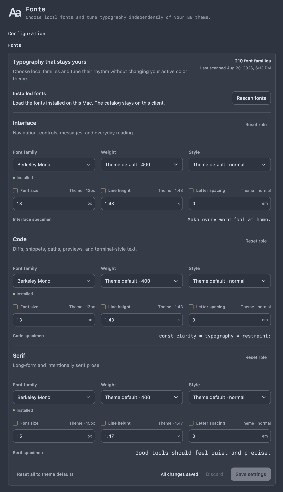

# Fonts for bb

Fonts is a client-local typography layer for [bb](https://getbb.app). It lets
each desktop window or browser profile choose installed font families and tune
type independently of the active color theme.



## Features

- Separate Interface, Code, and Serif roles.
- Searchable local-font catalog with manual family-name fallback.
- Per-role size, weight, style, line height, and letter spacing.
- Live previews with explicit Save and Discard actions.
- Theme inheritance per property and clean restoration when disabled.
- Client-local, versioned storage with cross-window synchronization.
- No telemetry and no font catalog sent to the bb server.

Local font enumeration uses Chromium's Local Font Access API. Desktop bb loads
the installed catalog after a user action. Browser clients may also ask for
permission. Unsupported clients retain manual family entry.

## Install

```sh
npm install
npm run build
bb plugin install .
```

Open **Settings → Plugins → Fonts**. The plugin contributes no color theme;
your selected typography remains active as palettes change.

## Development

```sh
npm test
npm run typecheck
npm run build
bb plugin reload fonts
```

## Boundaries

Fonts styles the bb document and plugin UI. Embedded websites, isolated browser
content, canvas terminals, and third-party shadow roots may retain their own
typography. Interface scale controls use bb's current typography variables and
degrade to family/style controls if those variables are unavailable.

## License

MIT
